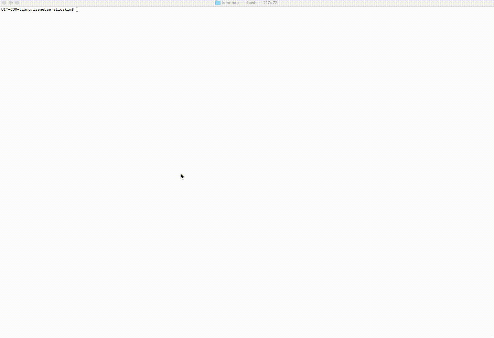

# <span id="top">Drupal Behat Mink Extension</span>
Behat is a test framework for behavior-driven development written in the PHP programming language.

## Table of Contents
* Requirements [&#10172;](#a)
* Get Started [&#10172;](#b)
* Directory Structure of a Simple Project Directory [&#10172;](#c)
* To Run Tests from the Terminal [&#10172;](#d)
* Example Output [&#10172;](#e)
* Drush/Drupal API Driver [&#10172;](#f)
* Using Selenium2 and ChromeDriver [&#10172;](#g)
* To Run Scenarios with \<Tag\> [&#10172;](#h)
* Regions & Messages [&#10172;](#j)
* Resources & Pages [&#10172;](#i)

## <div id="a">Requirements</div>
* __Composer__
* __PHP__ 5.3.5+
* __Selenium__ latest version

## <div id="b">Get Started</div>
1. Create a new directory. This will be your root directory.
2. Create __composer.json__ file. Copy and paste from [here](https://github.com/alice-0-kim/testing-tool-explained/blob/master/Behat/Demo/composer.json) or [here](https://github.com/alice-0-kim/testing-tool-explained/blob/master/Behat/Drupal/D8.5.0/composer.json) if you are using Selenium WebDriver.
3. Run `composer install` from the root directory.
4. Create __behat.yml__ file. You can choose to simply copy and paste from [here](https://github.com/alice-0-kim/testing-tool-explained/blob/master/Behat/Drupal/D8.5.0/behat.yml).<br>There are several lines that are specific to the environment (e.x. wd_host, alias, directory path, etc). Make sure to check that all the information is pointing to your local environment.
5. Run `bin/behat --init`. This will create a features/ directory.
6. Run `bin/behat -dl` to make sure everything has been configured. The output should look similar to:
```
$ bin/behat -dl
default | Given I am an anonymous user
default | Given I am not logged in
default | Given I am logged in as a user with the :role role(s)
```

## <div id="c">Directory Structure of a Simple Project Directory</div>
__root directory__<br>
&nbsp;&nbsp;&nbsp;&nbsp;&nbsp;|-- __behat.yml__<br>
&nbsp;&nbsp;&nbsp;&nbsp;&nbsp;|-- bin<br>
&nbsp;&nbsp;&nbsp;&nbsp;&nbsp;|-- __composer.json__<br>
&nbsp;&nbsp;&nbsp;&nbsp;&nbsp;|-- composer.lock<br>
&nbsp;&nbsp;&nbsp;&nbsp;&nbsp;'-- __features__<br>
&nbsp;&nbsp;&nbsp;&nbsp;&nbsp;|&nbsp;&nbsp;&nbsp;&nbsp;&nbsp;|-- bootstrap<br>
&nbsp;&nbsp;&nbsp;&nbsp;&nbsp;|&nbsp;&nbsp;&nbsp;&nbsp;&nbsp;|&nbsp;&nbsp;&nbsp;&nbsp;&nbsp;'-- __FeatureContext.php__<br>
&nbsp;&nbsp;&nbsp;&nbsp;&nbsp;|&nbsp;&nbsp;&nbsp;&nbsp;&nbsp;'-- __demo.feature__<br>
&nbsp;&nbsp;&nbsp;&nbsp;&nbsp;'-- vendor<br>

## <div id="d">To Run Test from the Terminal</div>
Run __bin/behat__ from the root directory.
```
$ bin/behat
```
It will look smiliar to:


## <div id="e">Example output</div>

### When the test fails:


### When the test succeeds:


### UPDATE: test run with multiple scenarios




## <div id="f">Drush/Drupal API Driver</div>
* use to add users, reset passwords, and log in to websites
### Set up
  Locate to the local project directory and run:
```
drush sa
```
  Grab one alias to use in your behat.yml:
```
Drupal\DrupalExtension:
  blackbox: ~
  api_driver: 'drush' 
  drush:
    root: YOUR_PROJECT_ROOT
    alias: 'YOUR_ALIAS'
  region_map:
    footer: "#footer"
```
  Then in your .feature file, add @api tag:
```
@api
  Scenario: Check that Administrator has access to ...
```
  Run using `bin/behat` to make sure no error is being thrown

## <div id="g">Using Selenium2 and ChromeDriver</div>
### Selenium installation
1. Download __Selenium Standalone Server__ from [here](https://www.seleniumhq.org/download/). As of today(Thu 2018-03-29 9:11 am), the current download version is 3.11.0.<br> The file name should be similar to this:__selenium-server-standalone-3.9.1.jar__. Replace the version number if necessary.
2. Download __ChromeDriver__ from [here](https://chromedriver.storage.googleapis.com/index.html?path=2.35/). Click one of the links depending on your local environment.
3. Once you have the ZIP file downloaded on your machine, unzip it and move the executible to __/usr/local/bin__ directory, or run:
```
mv PATH-TO-CHROMEDRIVER/chromedriver /usr/local/bin
```
4. Edit behat.yml file.&#42; &#42;&#42;
5. Edit composer.json file.&#42;
6. Run `composer update`. This will take a while.
7. Add @javascript tag in .feature files.
```
Feature: Check link functionality of website
  In order to ...
  As an administrator
  I want to be able to ...

  @javascript
  Scenario: Should be redirected to homepage when I click home
    Given I am on "/"
    ...
```
8. Run below lines to start Selenium Server.
```
java -jar ~/Downloads/selenium-server-standalone-3.9.1.jar -role hub
java -jar ~/Downloads/selenium-server-standalone-3.9.1.jar -port 4444
```
9. Open up a new terminal to run `bin/behat`. You should see that Google Chrome web browser is launched whenever any scenarios with @javascript tag attached.

&#42; The example behat.yml and composer.json files are located in /Drupal.<br>
&#42;&#42; __wd_host__ in behat.yml file should be adjusted based on the output when you start the Selenium Server. The output can be found in the similar format as:
```
09:21:55.237 INFO - Selenium Grid hub is up and running
09:21:55.237 INFO - Nodes should register to http://128.189.64.164:4444/grid/register/
09:21:55.237 INFO - Clients should connect to http://128.189.64.164:4444/wd/hub
```

## <div id="h">To Run Scenarios with \<Tag\></div>
### To Run Scenarios with @admin
```
bin/behat --tags="@admin"
```
### To Run Scenarios with @node and @javascript
```
bin/behat --tags="@node&&@javascript"
```
### To Run Scenarios with @node, @api, or @announcement
```
bin/behat --tags="@node,@api,@announcement"
```
### To Run Scenarios without @exclude
```
bin/behat --tags="~@exclude"
```

## <div id="j">Regions & Messages</div>
### Add regions to refer to on _.feature_ files
When you need to refer to a certain region within a page, you can refer to them through 'header' or 'footer' which are readable and easy to understand rather than complex CSS selectors.
To add regions, add __region_map__ under __Drupal\DrupalExtension__:
```
Drupal\DrupalExtension:
  region_map:
    header:  "#ubc7-header"
    content: "#unit-content"
    footer:  "#ubc7-footer"
```

When you want to check if there is(are) message(s) on the page, either success or error, then you might want to use MessageContext on top of Drupal/MinkContext. To make use of methods declared in MessageContext.php, you must configure selectors for message selectors.
To configure message selectors, add __selectors__ under __Drupal\DrupalExtension__:

```
Drupal\DrupalExtension:
  region_map:
    header:  "#ubc7-header"
    content: "#unit-content"
    footer:  "#ubc7-footer"
  selectors:
    message_selector: ".messages"
    error_message_selector: ".messages.messages--error"
    success_message_selector: ".messages.messages--status"
```
Note that selectors might have CSS selectors different from the example provided above.

## <div id="i">Resources & Pages</div>
* A brief summary of different testing tools including Behat/Mink Extension, Travis CI, and more [&#10172;](https://affinitybridge.com/blog/testing-drupal-distributions-using-behat-mink-drupal-extension-and-travis-ci)
* The Drupal Extension to Behat and Mink’s documentation [&#10172;](https://behat-drupal-extension.readthedocs.io/en/3.1)
* A list of Whens, Thens, and Givens for Drupal Behat testing [&#10172;](https://gist.github.com/mikecrittenden/618e57a41286e555dea8)
  - Note: 'When the cash has been cleared' is deprecated for Drupal 8 and later.<br>To clear cash, use 'When I run drush "cr"' instead.
* __Selenium2Driver.php__ GitHub page: a list of available methods for Selenium2 Driver [&#10172;](https://github.com/minkphp/MinkSelenium2Driver/blob/30c81e822fc11a532c3a291781f30b7b74b17ed0/src/Selenium2Driver.php)
* __DrupalContext.php__ GitHub page [&#10172;](https://github.com/jhedstrom/drupalextension/blob/master/src/Drupal/DrupalExtension/Context/DrupalContext.php)
* @docksal GitHub page [&#10172;](https://github.com/docksal/behat)

Go Back to Top [&#10172;](#top)
