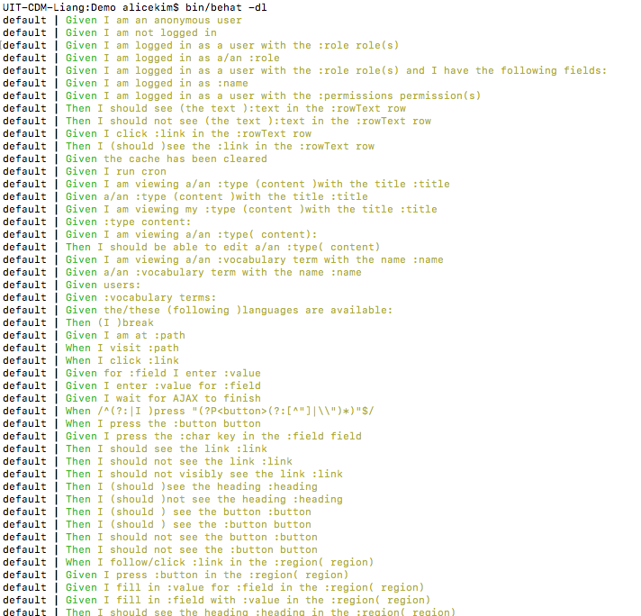
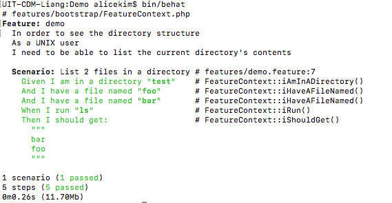
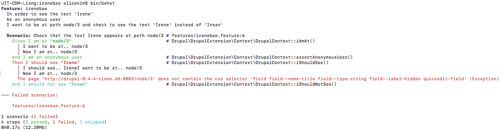
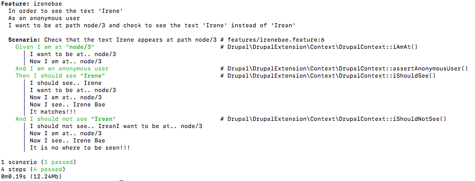
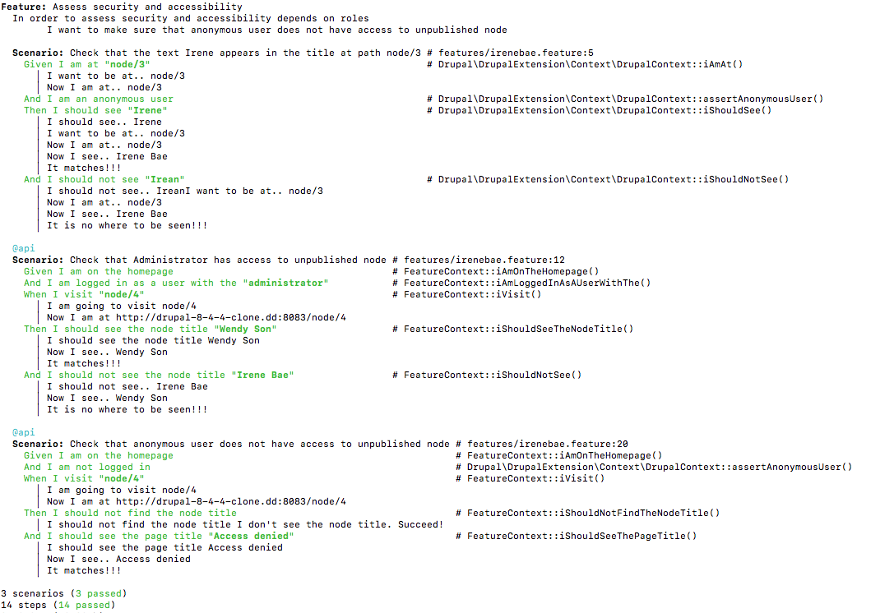

# Behat
Behat is a test framework for behavior-driven development written in the PHP programming language.

## Requirements
* __Composer__
* __PHP__ 5.3.5+
* __Selenium__ latest version

## Get Started
1. Create a new directory called __new-dir__. Note that this is __Demo__ directory in our demo.
2. Create __composer.json__ file. Copy and paste from [here](https://github.com/alice-0-kim/testing-tool-explained/blob/master/Behat/Demo/composer.json).
3. Run `composer install` from __new-dir__ directory.
4. Run `bin/behat --init`. This will create a features/ directory.
5. Run `bin/behat -dl` to make sure everything has been configured. The output should look similar to:


## Directory Structure for a Simple Project Directory
___Demo___<br>
&nbsp;&nbsp;&nbsp;&nbsp;&nbsp;|-- __behat.yml__<br>
&nbsp;&nbsp;&nbsp;&nbsp;&nbsp;|-- bin<br>
&nbsp;&nbsp;&nbsp;&nbsp;&nbsp;|-- __composer.json__<br>
&nbsp;&nbsp;&nbsp;&nbsp;&nbsp;|-- composer.lock<br>
&nbsp;&nbsp;&nbsp;&nbsp;&nbsp;'-- __features__<br>
&nbsp;&nbsp;&nbsp;&nbsp;&nbsp;|&nbsp;&nbsp;&nbsp;&nbsp;&nbsp;|-- bootstrap<br>
&nbsp;&nbsp;&nbsp;&nbsp;&nbsp;|&nbsp;&nbsp;&nbsp;&nbsp;&nbsp;|&nbsp;&nbsp;&nbsp;&nbsp;&nbsp;'-- __FeatureContext.php__<br>
&nbsp;&nbsp;&nbsp;&nbsp;&nbsp;|&nbsp;&nbsp;&nbsp;&nbsp;&nbsp;'-- __demo.feature__<br>
&nbsp;&nbsp;&nbsp;&nbsp;&nbsp;'-- vendor<br>

## To Run Test from Terminal
Run __bin/behat__ from the root(__Demo__ directory in our demo).
It will look smiliar to:



## Example output for irenebae.feature file

### When the test fails:


### When the test succeeds:


### UPDATE: test run with multiple scenarios


## Drush/Drupal API Driver
* use to add users, reset passwords, and log in to websites
### Set up
  Locate to the local project directory and run:
```
drush sa
```
  Grab one alias to use in your behat.yml:
```
Drupal\DrupalExtension:
  blackbox: ~
  api_driver: 'drush' 
  drush:
    root: YOUR_PROJECT_ROOT
    alias: 'YOUR_ALIAS'
  region_map:
    footer: "#footer"
```
  Then in your .feature file, add @api tag:
```
@api
  Scenario: Check that Administrator has access to ...
```
  Run using `bin/behat` to make sure no error is being thrown
