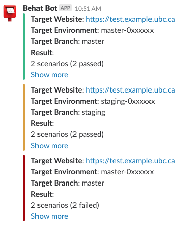

# <span id="top">Drupal Behat Mink Extension</span>
Behat is a test framework for behavior-driven development written in the PHP programming language.

## Table of Contents
* Requirements [:point_right:](#a)
* Get Started [:point_right:](#b)
* Directory Structure of a Simple Project Directory [:point_right:](#c)
* To Run Tests from the Terminal [:point_right:](#d)
* Example Output [:point_right:](#e)
* Output a Report as a File [:point_right:](#user-content-output-a-report-as-a-file)
* Output a Report to a Slack channel [:point_right:](#user-content-output-a-report-to-a-slack-channel)
* Drush/Drupal API Driver [:point_right:](#f)
* Using Selenium WebDriver and ChromeDriver [:point_right:](#g)
* To Run Scenarios with \<Tag\> [:point_right:](#h)
* Regions & Messages [:point_right:](#j)
* Drupal 8 Health Check module [:point_right:](#l)
* Unresolved Issues & Possible Exceptions to encounter [:point_right:](#k)
* Resources & Pages [:point_right:](#i)

## <div id="a">Requirements</div>
* __Composer__
* __PHP__ 5.3.5+
* __Selenium__ latest version

## <div id="b">Get Started</div>
1. Create a new directory. This will be your root directory.
2. Create __composer.json__ file. You can simply use below example to begin with. Note that the last line of `require` block is only required if you're working with Selenium WebDriver.
```json
{
  "require": {
    "behat/behat": "~3.1",
    "drupal/drupal-extension": "~3.0",
    "guzzlehttp/guzzle" : "^6.0@dev",
    "behat/mink": "1.5.*@stable",
    "behat/mink-goutte-driver": "*",
    "behat/mink-extension": "*",
    "behat/mink-selenium2-driver": "*"
},
  "config": {
    "bin-dir": "bin/"
  }
}
```
3. Run `composer install` from the root directory. You may encounter this message at the end of installation process:
```
Package guzzle/common is abandoned, you should avoid using it. Use guzzle/guzzle instead.
Package guzzle/stream is abandoned, you should avoid using it. Use guzzle/guzzle instead.
Package guzzle/parser is abandoned, you should avoid using it. Use guzzle/guzzle instead.
Package guzzle/http is abandoned, you should avoid using it. Use guzzle/guzzle instead.
```
which is expected as addressed in [__here__](https://github.com/ampache/ampache/issues/957).

4. Create __behat.yml__ file. Below example has all the necessary attributes to get started. However, if you're working with Selenium WebDriver, you should look into this example provided [__here__](https://github.com/alice-0-kim/testing-tool-explained/blob/master/Behat/Drupal/D8.5.0.2/behat.yml).
```
default:
  suites:
    default:
      contexts:
        - Drupal\DrupalExtension\Context\DrupalContext
        - Drupal\DrupalExtension\Context\MinkContext
        - FeatureContext
  extensions:
    Behat\MinkExtension:
      goutte: ~
      selenium2: ~
      base_url: https://your.sitedomain.ca
    Drupal\DrupalExtension:
      blackbox: ~
```
There are several lines that are specific to the environment (e.x. base_url, etc). Make sure to check that all the information is pointing to your local environment.

5. Run `bin/behat --init`. This will create a features/ directory.
6. Run `bin/behat -dl` to make sure everything has been configured. The output should look similar to:
```
$ bin/behat -dl
default | Given I am an anonymous user
default | Given I am not logged in
default | Given I am logged in as a user with the :role role(s)
```

## <div id="c">Directory Structure of a Simple Project Directory</div>
__root directory__<br>
&nbsp;&nbsp;&nbsp;&nbsp;&nbsp;|-- __behat.yml__<br>
&nbsp;&nbsp;&nbsp;&nbsp;&nbsp;|-- bin<br>
&nbsp;&nbsp;&nbsp;&nbsp;&nbsp;|-- __composer.json__<br>
&nbsp;&nbsp;&nbsp;&nbsp;&nbsp;|-- composer.lock<br>
&nbsp;&nbsp;&nbsp;&nbsp;&nbsp;'-- __features__<br>
&nbsp;&nbsp;&nbsp;&nbsp;&nbsp;|&nbsp;&nbsp;&nbsp;&nbsp;&nbsp;|-- bootstrap<br>
&nbsp;&nbsp;&nbsp;&nbsp;&nbsp;|&nbsp;&nbsp;&nbsp;&nbsp;&nbsp;|&nbsp;&nbsp;&nbsp;&nbsp;&nbsp;'-- __FeatureContext.php__<br>
&nbsp;&nbsp;&nbsp;&nbsp;&nbsp;|&nbsp;&nbsp;&nbsp;&nbsp;&nbsp;'-- __demo.feature__<br>
&nbsp;&nbsp;&nbsp;&nbsp;&nbsp;'-- vendor<br>

## <div id="d">To Run Test from the Terminal</div>
Run __bin/behat__ from the root directory.
```
$ bin/behat
```
It will look smiliar to:


## <div id="e">Example output</div>

### When the test fails:


### When the test succeeds:


### UPDATE: test run with multiple scenarios


## Output a Report as a File
```
$ bin/behat --no-colors --format pretty --out report.txt
```
It tells Behat to write an output of the test result in a pretty format inside report.txt file.

## Output a Report to a Slack Channel
```
$ OUTPUT="$(bin/behat)"
$ curl -X POST --data-urlencode "payload={'channel': '#uptime', 'username': 'Behat Bot', 'icon_emoji': ':postbox:', 'attachments':[{'color':'danger', 'text': '*Target Website*: https://test.example.ubc.ca \n *Target Environment*: master-0xxxxxx \n *Target Branch*: master \n *Result*: \n 2 scenarios (2 failed) \n 5 steps (5 failed) \n 0m4.46s (19.02Mb)'}]}" https://hooks.slack.com/services/xxxxxxxxx/xxxxxxxxx/xxxxxxxxxxxxxxxxxxxxxxxx
```
It sends a POST request to Slack server to post an output from the command inside the bracket.


## <div id="f">Drush/Drupal API Driver</div>
__Drupal extension__ provides drivers for interacting with your site which are compatible with __Drupal 6, 7, and 8__. For more information about three types of drivers and their limitations, go to [__here__](http://behat-drupal-extension.readthedocs.io/en/3.1/drivers.html)

Unlike the __blackbox driver__ which tasks like creating new users or logging in/out process are done via user interface, __Drush/Drupal API driver__ have a set of methods already defined for us to use:
* add users
* reset passwords
* log in/out
* run drush commands

and much more tasks can be done just by writing test cases in _.feature_ files.
### Set up
  Locate to the local project directory and run:
```
drush sa
```
  Grab one alias to use in your behat.yml:
```
Drupal\DrupalExtension:
  blackbox: ~
  api_driver: 'drush' 
  drush:
    root: YOUR_PROJECT_ROOT
    alias: 'YOUR_ALIAS'
  region_map:
    footer: "#footer"
```
  Then in your .feature file, add @api tag:
```
@api
  Scenario: Check that Administrator has access to ...
```
  Without the @api tag, blackbox driver will be used as default.
  Run using `bin/behat` to make sure no error is being thrown.

### Remote Server
  If you have a remote server that houses a Drupal instance that you want to test with Behat:
  1. Update your drush aliases file. In MacOS, it is located in `~/.drush` directory with a file name similarly structured as `project.aliases.drushrc.php`. An example file that is automatically generated by Platform.sh CLI looks like:
  ```
  <?php
  /**
   * Drush aliases for the Platform.sh project "Your Project".
   *
   * This file is auto-generated by the Platform.sh CLI.
   *
   * WARNING
   * This file may be regenerated at any time.
   * - User-defined aliases will be preserved.
   * - Aliases for active environments (including any custom additions) will be preserved.
   * - Aliases for deleted or inactive environments will be deleted.
   * - All other information will be deleted.
   */

  $aliases['_you'] = array (
    'root' => '/Users/path/to/local/project/directory/_www',
    'platformsh-cli-auto-remove' => true,
  );

  $aliases['project'] = array (
    'root' => '/xxx/web',
    'platformsh-cli-auto-remove' => true,
    'uri' => 'https://your-project-domain.xx.platform.sh/',
    'remote-host' => 'ssh.xx.platform.sh',
    'remote-user' => 'xxxxxxxxxxxxx-xxx-x--xxxxx-xxx',
  );
  ```
  2. Update your `behat.yml` file. Under `drush` in `Drupal\DrupalExtension\Extension`:
  ```
   Drupal\DrupalExtension\Extension:
     drush:
       alias: project
  ```
## <div id="g">Using Selenium WebDriver and ChromeDriver</div>
### Selenium installation
1. Download __Selenium Standalone Server__ from [__here__](https://www.seleniumhq.org/download/). As of today(Thu 2018-03-29 9:11 am), the current download version is 3.11.0.<br> The file name should be similar to this:__selenium-server-standalone-3.11.0.jar__ where the last three digits indicate which version you are downloading.<br><br>
If you encounter __'This type of file can harm your computer. Are you sure you want to download...'__ issue on Google Chrome, you can temporarily this warning by enabling __Ask where to save each file before downloading__ option in __Settings__.<br>


2. Download __ChromeDriver__ from [__here__](https://chromedriver.storage.googleapis.com/index.html?path=2.35/). Click one of the links depending on your local environment.
3. Once you have the ZIP file downloaded on your machine, unzip it and move the executible to __/usr/local/bin__ directory, or run:
```
mv PATH-TO-CHROMEDRIVER/chromedriver /usr/local/bin
```
4. Edit behat.yml file.&#42; Make sure to include wd_host option under the `extension`:
```
extensions:
  Behat\MinkExtension:
    files_path: '%paths.base%'
    base_url: 'https://example.it.ubc.ca'
    goutte: ~
    selenium2:
      wd_host: http://127.0.0.1:4444/wd/hub
```
5. Edit composer.json file.&#42;
6. Run `composer update`. This will take a while.
7. Add @javascript tag in .feature files.
```
Feature: Check link functionality of website
  In order to ...
  As an administrator
  I want to be able to ...

  @javascript
  Scenario: Should be redirected to homepage when I click home
    Given I am on "/"
    ...
```
8. Run below lines to start Selenium Server.

The required version of Java in order to run the file:
```
$ java -version
java version "1.8.0_152"
Java(TM) SE Runtime Environment (build 1.8.0_152-b16)
Java HotSpot(TM) 64-Bit Server VM (build 25.152-b16, mixed mode)
```
Note that the argument specifies where you downloaded .jar file, thus it should be adjusted accordingly.
```
java -jar ~/Downloads/selenium-server-standalone-3.11.0.jar
```
9. Open up a new terminal to run `bin/behat`. You should see that Google Chrome web browser is launched whenever any scenarios with @javascript tag attached.

&#42; The example behat.yml and composer.json files are located in `/Drupal`.<br>

## <div id="h">To Run Scenarios with \<Tag\></div>
### To Run Scenarios with @admin
```
bin/behat --tags="@admin"
```
### To Run Scenarios with @node and @javascript
```
bin/behat --tags="@node&&@javascript"
```
### To Run Scenarios with @node, @api, or @announcement
```
bin/behat --tags="@node,@api,@announcement"
```
### To Run Scenarios without @exclude
```
bin/behat --tags="~@exclude"
```

__Tags__ can be used in step-definition files (e.g. FeatureContext.php) to run certain methods under certain circumstances:
```
/**
 * @BeforeScenario @header&&@admin
 */
public function doExample()
{
    // do example
    // before scenarios with @header AND @admin
    // tags
}
```

## <div id="j">Regions & Messages</div>
### Add regions to refer to on _.feature_ files
When you need to refer to a certain region within a page, you can refer to them through 'header' or 'footer' which are readable and easy to understand rather than complex CSS selectors.
To add regions, add __region_map__ under __Drupal\DrupalExtension__:
```
Drupal\DrupalExtension:
  region_map:
    header:  "#ubc7-header"
    content: "#unit-content"
    footer:  "#ubc7-footer"
```

When you want to check if there is(are) message(s) on the page, either success or error, then you might want to use MessageContext on top of Drupal/MinkContext. To make use of methods declared in MessageContext.php, you must configure selectors for message selectors.
To configure message selectors, add __selectors__ under __Drupal\DrupalExtension__:

```
Drupal\DrupalExtension:
  region_map:
    header:  "#ubc7-header"
    content: "#unit-content"
    footer:  "#ubc7-footer"
  selectors:
    message_selector: ".messages"
    error_message_selector: ".messages.messages--error"
    success_message_selector: ".messages.messages--status"
```
Note that selectors might have CSS selectors different from the example provided above.

## <div id="l">Drupal 8 HealthCheck Module</div>
GitHub repository: [here](https://github.com/alice-0-kim/healthcheck)

## <div id="k">Unresolved Issues & Possible Exceptions to encounter</div>
There are exceptions and/or possible issues that are expected to arise while working with Behat and WebDriver. Here we have a list of possible exceptions/issues and how to resolve them. Also, there are issues that are not yet resolved here or currently being worked on.
### Possible Issues & How to Resolve
#### Could not open connection (Behat\Mink\Exception\DriverException)
The exception is thrown when you forget to start webdriver before running test cases that requires JS/AJAX support (marked as @javascript on feature files). Make sure that you have started the webdriver by running `java -jar ~/Downloads/selenium-server-standalone-3.11.0.jar -port 4444`.
#### Status code is not available from Behat\Mink\Driver\Selenium2Driver (Behat\Mink\Exception\UnsupportedDriverActionException)
As it is mentioned here, such feature would not be added to the WebDriver API as it falls outside of its scope as a browser emulator.
An alternative option would be to remove @javascript tag, use [__Restler__](https://github.com/Luracast/Restler), a simple and effective multi-format Web API Server written in PHP, or to use __Blackfire Player__.

A simple example:
```
Feature: Authentication
  Scenario: HTTP request should have a status code == 200
    Given I am on "/"
    Then the response status code should be 200
    When I am on "/node/1"
    # /node/1 has been created, 200 is expected
    # test should PASS
    Then the response status code should be 200
    When I am on "/node/2"
    # /node/2 has NOT been created, 404 is expected
    # test should PASS
    Then the response status code should be 404
    When I am on "/node/2"
    # /node/2 has NOT been created, 404 is expected
    # test should FAIL
    Then the response status code should be 302
```
And the expected output:
```
Feature: Authentication

  Scenario: HTTP request should have a status code == 200 # features/auth.feature:4
    Given I am on "/"                                     # Behat\MinkExtension\Context\MinkContext::visit()
    Then the response status code should be 200           # Behat\MinkExtension\Context\MinkContext::assertResponseStatus()
    When I am on "/node/1"                                # Behat\MinkExtension\Context\MinkContext::visit()
    Then the response status code should be 200           # Behat\MinkExtension\Context\MinkContext::assertResponseStatus()
    When I am on "/node/2"                                # Behat\MinkExtension\Context\MinkContext::visit()
    Then the response status code should be 404           # Behat\MinkExtension\Context\MinkContext::assertResponseStatus()
    When I am on "/node/2"                                # Behat\MinkExtension\Context\MinkContext::visit()
    Then the response status code should be 302           # Behat\MinkExtension\Context\MinkContext::assertResponseStatus()
      Current response status code is 404, but 302 expected. (Behat\Mink\Exception\ExpectationException) # test is failed as expected
```

## <div id="i">Resources & Pages</div>
* A brief summary of different testing tools including Behat/Mink Extension, Travis CI, and more [:point_right:](https://affinitybridge.com/blog/testing-drupal-distributions-using-behat-mink-drupal-extension-and-travis-ci)
* The Drupal Extension to Behat and Mink’s documentation [:point_right:](https://behat-drupal-extension.readthedocs.io/en/3.1)
* A list of Whens, Thens, and Givens for Drupal Behat testing [:point_right:](https://gist.github.com/mikecrittenden/618e57a41286e555dea8)
  - Note: 'When the cash has been cleared' is deprecated for Drupal 8 and later.<br>To clear cash, use 'When I run drush "cr"' instead.
* __Selenium2Driver.php__ GitHub page: a list of available methods for Selenium2 Driver [:point_right:](https://github.com/minkphp/MinkSelenium2Driver/blob/30c81e822fc11a532c3a291781f30b7b74b17ed0/src/Selenium2Driver.php)
* __DrupalContext.php__ GitHub page [:point_right:](https://github.com/jhedstrom/drupalextension/blob/master/src/Drupal/DrupalExtension/Context/DrupalContext.php)
* @docksal GitHub page [:point_right:](https://github.com/docksal/behat)

Go back to top [:point_up:](#top)
